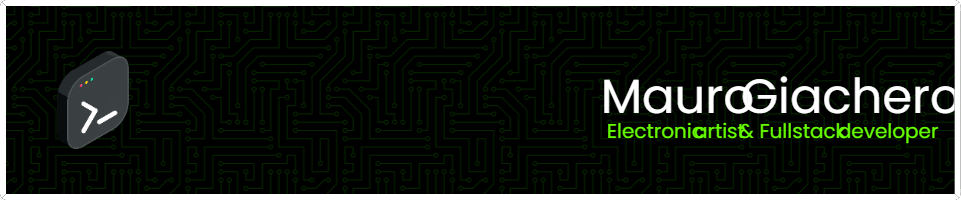

🤓 Electronics arts nerd  
🎮 Web and videogames development  
🌱 Currently learning node.js  
👨‍🎓 Studing at UNA, Buenos Aires, ARG

## ⚠ Stack
   	 	 	

<!---
mauroncho/mauroncho is a ✨ special ✨ repository because its `README.md` (this file) appears on your GitHub profile.
You can click the Preview link to take a look at your changes.
--->
